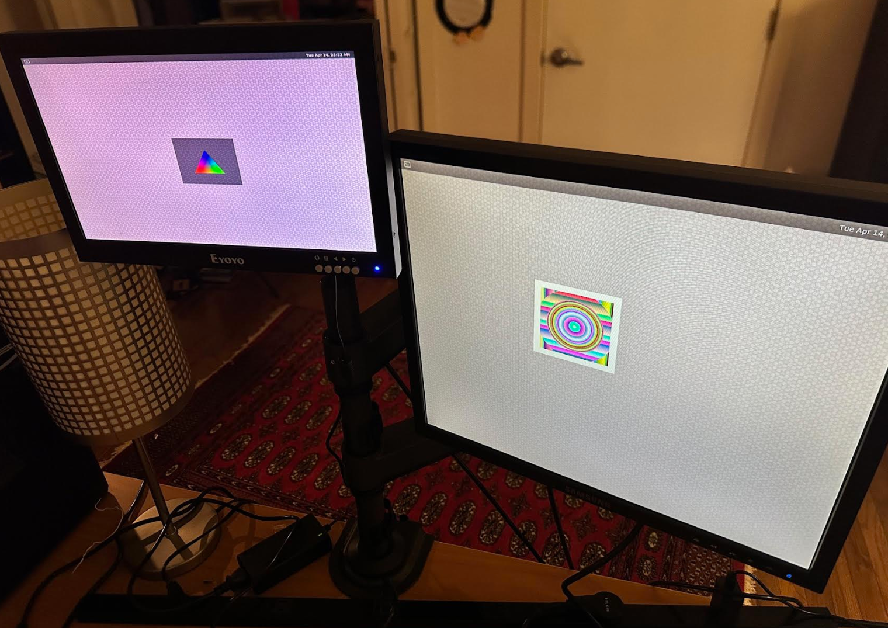

# Multiscreen Example

Demonstrates an extended Weston desktop across two displays, with draggable windows and a panel clock. Runs on any device supported by the display block.



---

## How it works

Two services share a named volume (`display-socket`) mounted at `/run`:

| Service | Role |
|---|---|
| `display` | Runs Weston with `desktop-shell.so` (extended desktop, draggable windows, panel with clock). Generates `weston.ini` at runtime from environment variables, auto-detects connected outputs, then starts the display block. |
| `apps` | Waits for the Wayland socket, then launches two demo clients (`APP1`, `APP2`) side-by-side. |

Connected outputs are discovered at startup by reading `/sys/class/drm/card*-*/status`. The first connected output becomes the primary (position `0,0`) and the second becomes the secondary (placed immediately to the right). Virtual connectors such as `Writeback-1` are automatically excluded.

---

## Environment variables

### `display` service

#### Layout

| Variable | Default | Description |
|---|---|---|
| `MULTISCREEN_ENABLED` | `1` | Set to `0` to disable the secondary output and run single-screen. |
| `PRIMARY_DISPLAY` | *(auto-detected)* | Weston output name for the primary screen (e.g. `DSI-1`). Auto-detected as the first connected output if unset. |
| `SECONDARY_DISPLAY` | *(auto-detected)* | Weston output name for the secondary screen (e.g. `HDMI-A-1`). Auto-detected as the second connected output if unset. |
| `PRIMARY_MODE` | `current` | Resolution for the primary output. Use `current` to keep the display's preferred mode, or specify explicitly e.g. `800x480`. |
| `SECONDARY_MODE` | `1920x1080` | Resolution for the secondary output. Defaults to 1080p to prevent the HDMI port negotiating an unexpected mode. |

#### Rotation

Rotation is set **per display name** to avoid ambiguity when `PRIMARY_DISPLAY` and `SECONDARY_DISPLAY` are swapped or auto-detected.

The variable name is `ROTATION_` followed by the output name, uppercased with hyphens replaced by underscores:

| Output | Env var |
|---|---|
| `DSI-1` | `ROTATION_DSI_1` |
| `HDMI-A-1` | `ROTATION_HDMI_A_1` |
| `HDMI-A-2` | `ROTATION_HDMI_A_2` |

**Valid values:** `normal` (default) · `rotate-90` · `rotate-180` · `rotate-270`

> ⚠️ **Rotation 90° / 270° pitfall — update `PRIMARY_MODE` accordingly**
>
> Weston uses `PRIMARY_MODE` to calculate where to place the secondary output (it starts at `x = primary_width`). When the primary display is rotated 90° or 270°, the physical width and height swap. The value Weston uses for positioning is the **post-rotation** width — i.e. the original display height.
>
> **Example:** a 7" DSI display at 800×480 rotated 90° has a post-rotation width of 480 px, not 800 px. Without correction the secondary output would be placed at x=800, leaving a 320 px gap or overlap.
>
> **Fix:** set `PRIMARY_MODE` to the actual resolution so the width can be read unambiguously:
>
> ```
> PRIMARY_MODE=800x480
> ROTATION_DSI_1=rotate-90
> # Secondary will now be placed at x=480 (the rotated width)
> ```
>
> When `PRIMARY_MODE=current` and a 90°/270° rotation is applied, set `PRIMARY_MODE` to the known resolution to ensure correct secondary positioning.

#### Renderer

| Variable | Default | Description |
|---|---|---|
| `WESTON_RENDERER` | *(auto)* | Weston compositor renderer. On Raspberry Pi with multiscreen enabled, automatically defaults to `pixman` to avoid a known DRM cursor plane crash ([meta-raspberrypi#1407](https://github.com/agherzan/meta-raspberrypi/issues/1407)). Set to `gl` to force hardware rendering, or `pixman` to force software rendering on any device. |

### `apps` service

| Variable | Default | Description |
|---|---|---|
| `APP1` | `weston-simple-egl` | First demo application to launch. |
| `APP2` | `weston-simple-shm` | Second demo application to launch. |

**Available apps:**

| App | Rendering | Decorations | Notes |
|---|---|---|---|
| `weston-simple-egl` | GPU (EGL/GLES) | None | Move with **Super + drag** |
| `weston-simple-shm` | CPU | None | Move with **Super + drag** |
| `weston-flower` | CPU | None | Move with **Super + drag** |
| `weston-terminal` | CPU | CSD title bar | Draggable by title bar |

> **Moving windows without title bars:** `weston-simple-*` are raw `xdg-shell` clients with no client-side decorations. In Weston's desktop-shell, hold the **Super (⊞/⌘) key** and drag anywhere in the window to move it between screens.

---

## Quick start

```bash
balena push <your-fleet>
```

On first boot Weston will detect connected outputs, generate `weston.ini`, and launch the two demo apps. Open the balena dashboard to adjust any of the environment variables above — the `display` service restarts and regenerates its config automatically.

**To pin specific outputs** (useful if auto-detection picks the wrong order):

```
PRIMARY_DISPLAY=DSI-1
SECONDARY_DISPLAY=HDMI-A-1
```

**To rotate the 7" DSI display 90° and place HDMI correctly:**

```
PRIMARY_MODE=800x480
ROTATION_DSI_1=rotate-90
```

**To run single-screen:**

```
MULTISCREEN_ENABLED=0
```
